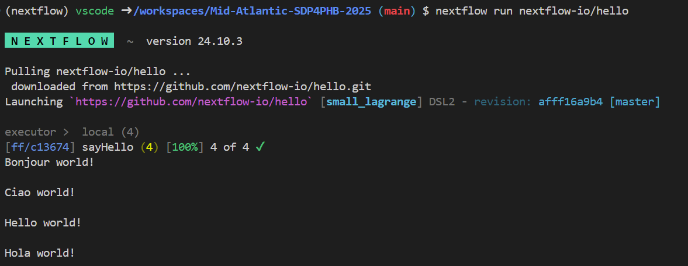

# Exercise 04: Writing Your First Nextflow Workflow

In this exercise, you will wrap the `fastq-peek.sh` script developed in [Exercise 02](./exercise02.md) and [Exercise 03](./exercise03.md) into a Nextflow workflow. We'll be getting an introduction into [Nextflow](https://www.nextflow.io/) (with a few sprinkles of [Conda](https://conda.io/) and [Docker](https://www.docker.com/) thrown in). 


## Installing Nextflow in Your System

### Conda

When installing the [Conda](https://conda.io/) package manager you have two options, [Anaconda](https://www.anaconda.com/products/distribution) or [Miniconda](https://conda.io/miniconda.html). Anaconda comes with a lot of pre-installed packages and Miniconda comes with the bare necessities. For our purposes, we'll be using Miniconda, so lets get it installed.

First things first, let's get Miniconda installed. _A link is used in the below code_, but for 
future reference you can always get links to the available
[Miniconda - Installers](https://docs.conda.io/en/latest/miniconda.html#latest-miniconda-installer-links).
Today, since we are on a Linux VM, we will be installing the `Miniconda3 Linux 64-bit` version. 

```{bash}
# Download Miniconda installer
wget https://repo.anaconda.com/miniconda/Miniconda3-latest-Linux-x86_64.sh

# Run installer
bash Miniconda3-latest-Linux-x86_64.sh

# >>> In order to continue the installation process, please review the license
# >>> agreement.
# >>> Please, press ENTER to continue
# Press <enter> here to read the license
# 
# >>> ... <LICENSE> ...
# 
# >>> Do you accept the license terms? [yes|no]
# Type 'yes' (without quotes) to accept the license
# >>> ...
# >>>  - Press ENTER to confirm the location
# >>>  - Press CTRL-C to abort the installation
# >>>  - Or specify a different location below
# >>>
# >>> [/home/vscode/miniconda3] >>>
# Press <enter> to install to the default location
# 
# ... Installation and setup will happen ...
# 
# >>> installation finished.
# >>> Do you wish the installer to initialize Miniconda3
# >>> by running conda init? [yes|no]
# Type 'yes' (without quotes) to initialize Miniconda
# 
# >>> Thank you for installing Miniconda3!
source ~/.bashrc
```

If everything was successful, you should now have `(base)` at the start of your command line:

```{bash}
(base) vscode ➜ /workspaces/Mid-Atlantic-SDP4PHB-2025 (main) $  
```

---

#### Conda Rules of Thumb

Its no secret, Conda can be quite sensitive to change. In order to keep Conda happy, try to follow the following rules. By following these, Conda will stay happy, which means you will too!

__Rule Number 1 - Keep `base` clean__  
Keep your base environment clean! Try to avoid installing anything in your `base` environment (_there are a few exceptions!_). If your `base` environment breaks, you have to reinstall Miniconda. 

_There is an exception to this rule of thumb though!_

__Rule Number 2 - Create enviroments__  
`conda create` is your friend, use it for everything! Treat environments as consumables, create them, install in them, delete them.  

__Rule Number 3 - Use containers for critical tasks__
Conda is great, but for critical things its best to use containers (Docker or Singularity). Containers are static and 
once built you know exactly what it contains. When installing packages through Conda dependencies are selected at the
time of installation. Therefore if you install something today, then again in 6 months, you are likely to get different
tool versions.

---

### Nextflow

In this exercise
you will be getting an introduction into [Nextflow](https://www.nextflow.io/). Nextflow is both
a language and workflow manager.

For this exercise the goal is to:

1. Create a `nextflow` environment
2. Execute "Hello World"
3. Write our first Nextflow workflow with `fastq-peek.sh`

### Create a `nextflow` environment

Create an environment for nextflow:

```{bash}
conda create -y -n nextflow -c conda-forge -c bioconda nextflow
conda activate nextflow
nextflow -version

      N E X T F L O W
      version 24.10.3 build 5933
      created 16-12-2024 15:34 UTC (15:34 GMT)
      cite doi:10.1038/nbt.3820
      http://nextflow.io

```

Based on this, Nextflow v22.04.0 was installed in my `nextflow` environment. You can see the release notes at [v24.10.3](https://github.com/nextflow-io/nextflow/releases/tag/v24.10.3).

## Execute "Hello World"

A convenient of Nextflow is that you can provide it an address to a GitHub repo and Nextflow will
execute any existing workflows. Let's give it a try with [nextflow-io/hello](https://github.com/nextflow-io/hello).

```{bash}
nextflow run nextflow-io/hello
```

<p align="center">
  
</p>

And just like that you've just executed a Nextflow pipeline! 

If we take a look at the folder contents you'll have a few new folders and files:
```{bash}
(...)
drwxr-xr-x  4 vscode vscode 4.0K Jan 20 17:53 .nextflow
-rw-r--r--  1 vscode vscode 9.1K Jan 20 17:53 .nextflow.log
(...)
drwxr-xr-x  6 vscode vscode 4.0K Jan 20 17:53 work
```

#### `.nextflow` Folder

The `.nextflow` folder is created by Nextflow to keep Nextflow related files. These files are
really only meant for Nextflow and used for things like caching and locking. I've been using
Nextflow for years and have never had a need to mess with any files in the `.nextflow` folder.

Once you've completed your Nextflow run, it is ok to delete the `.nextflow` folder. But please
keep in mind if you delete it you will no longer be able to resume (`-resume`) previous runs. So,
make sure you are actually done!

#### `.nextflow.log` File

The [.nextflow.log](https://www.nextflow.io/docs/edge/tracing.html#execution-log) contains all
sorts of logging information output by Nextflow. It can be quite
useful to sift through when things aren't working out like you expect them to. In this `.nextflow.log`
file you can see which [config files were loaded](https://www.nextflow.io/docs/edge/config.html)
and in what order, which [executor](https://www.nextflow.io/docs/edge/executor.html) was used, any
errors that might have occured, and many many more details.

#### `work` folder

The `work` folder is where all the Nextflow processes are executed. For each job Nextflow executes
a new folder is created in the `work` directory. This allows jobs to be executed in isolation and
not be affected by other jobs. 

But, the `work` directory is rather infamous for expanding to great sizes. For every job, the inputs
and outputs are staged in the work directory. As you might imagine, if you are using rather large 
input FASTQ files they are going to make the `work` directory grow rather large!

Once you've completed your Nextflow run, it is ok to delete the `work` folder. But please
keep in mind if you delete it you will no longer be able to resume (`-resume`) previous runs. So,
make sure you are actually done!

---


## Steps

1. **Set Up Your Development Environment**

   Ensure you have your development environment set up as described in [Exercise 01](./exercise01.md).

2. **Create a New Nextflow Script**

   Create a new file named `main.nf` in the root directory of your repository. This file will contain your Nextflow workflow.

3. **Define the Workflow**

   Open `main.nf` and define the workflow to run the `fastq-peek.sh` script. Use the following template:

   ```nf
   #!/usr/bin/env nextflow

   nextflow.enable.dsl=2

   process fastq_peek {
       input:
       path fastq_file

       output:
       stdout result

       script:
       """
       ./bin/fastq-peek.sh ${fastq_file}
       """
   }

   workflow {
       params.fastq_file = file(params.fastq_file)

       fastq_peek(params.fastq_file)
   }

4. **Create a Configuration File**

   Create a new file named `nextflow.config` in the root directory of your repository. This file will contain the configuration for your Nextflow workflow.

   ```groovy
   params {
       fastq_file = 'data/sample.fastq'
       output_dir = 'results'
   }

   process {
       executor = 'local'
       withName: fastq_peek {
           executor = 'local'
       }
   }

5. **Run the Workflow with Different Profiles**

   Nextflow allows you to run workflows with different profiles for testing and production environments. You can define these profiles in the `nextflow.config` file.

   Update your `nextflow.config` file to include profiles for `test` and `docker`:

   ```groovy
   params {
       fastq_file = 'data/sample.fastq'
       output_dir = 'results'
   }

   process {
       executor = 'local'
       withName: fastq_peek {
           executor = 'local'
       }
   }

   profiles {
       test {
           process.executor = 'local'
           params.fastq_file = 'data/test_sample.fastq'
       }
       docker {
           process.executor = 'docker'
           docker.enabled = true
           docker.container = 'your-docker-image'
       }
   }